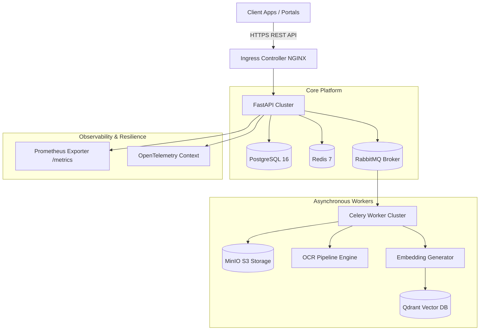

# Enterprise AI Document Intelligence Platform

[]()
[]()
[]()
[]()
[]()
[]()

> An enterprise-grade, event-driven document processing, OCR extraction, vector search, Retrieval-Augmented Generation (RAG), and DAG workflow automation engine built on Aladdin architectural principles.

---

## Table of Contents
- [Project Overview](#project-overview)
- [Motivation](#motivation)
- [Key Features](#key-features)
- [Technology Stack](#technology-stack)
- [Architecture Overview](#architecture-overview)
- [Folder Structure](#folder-structure)
- [System Components](#system-components)
- [Installation Guide](#installation-guide)
- [Local Development Setup](#local-development-setup)
- [Environment Variables](#environment-variables)
- [Running with Docker](#running-with-docker)
- [Running with Kubernetes](#running-with-kubernetes)
- [API Documentation](#api-documentation)
- [Authentication Guide](#authentication-guide)
- [OCR Pipeline Overview](#ocr-pipeline-overview)
- [Knowledge Engine Overview](#knowledge-engine-overview)
- [Enterprise RAG Overview](#enterprise-rag-overview)
- [Workflow Engine Overview](#workflow-engine-overview)
- [AI Features Overview](#ai-features-overview)
- [Monitoring & Observability](#monitoring--observability)
- [Production Deployment](#production-deployment)
- [Performance Considerations](#performance-considerations)
- [Security Features](#security-features)
- [Screenshots & Demo](#screenshots--demo)
- [Future Improvements](#future-improvements)
- [License](#license)

---

## Project Overview
The **Enterprise AI Document Intelligence Platform** is a scalable, resilient distributed application engineered to ingest, process, parse, index, search, and automate document workflows for enterprise financial and legal documents. It combines asynchronous OCR parsing, dense semantic embeddings, hybrid vector search (dense vector + BM25 lexical keyword matching), LLM context augmentation, DAG workflow orchestration, and enterprise observability.

---

## Motivation
Enterprise organizations handle millions of unstructured documents (PDFs, financial reports, SEC filings, scanned agreements). Traditional text extraction systems lack structural awareness, fail to handle complex tables, and suffer from high latency during high-concurrency peaks. This platform provides an end-to-end event-driven architecture that delivers sub-second hybrid retrieval, strict data governance, fault isolation via circuit breakers, and sub-15-minute disaster recovery.

---

## Key Features
- **Async OCR & Table Extraction**: Tesseract OCR, PyMuPDF, and pdfplumber with automatic bounding-box layout parsing.
- **Hybrid Vector Search**: Reciprocal Rank Fusion (RRF) combining Qdrant dense vector embeddings with BM25 keyword matching.
- **Enterprise RAG Engine**: Multi-stage RAG with query rewriting, reranking, source citation attribution, and LiteLLM integration.
- **DAG Workflow Automation**: Distributed DAG orchestration engine for executing parallel multi-step processing workflows.
- **AI Analytics**: Automatic summary generation, key entity extraction, classification, and metadata enrichment.
- **Enterprise Observability**: Prometheus metrics exposition, OpenTelemetry W3C trace context propagation, and structured JSON logs with sensitive secret redacting.
- **Production Reliability**: Circuit breakers (`CLOSED` -> `OPEN` -> `HALF_OPEN`), exponential backoff retry policies, and connection pool monitoring.

---

## Technology Stack

| Category | Component / Library |
| :--- | :--- |
| **Language & Framework** | Python 3.12, FastAPI, Pydantic V2 |
| **Database & Cache** | PostgreSQL 16 (AsyncAlchemy), Redis 7 |
| **Messaging & Workers** | RabbitMQ 3.13 (aio-pika), Celery 5.4 |
| **Object & Vector Storage** | MinIO S3 Object Storage, Qdrant Vector Database |
| **OCR & Embeddings** | Tesseract OCR, PyMuPDF, Sentence-Transformers (`all-MiniLM-L6-v2`) |
| **LLM Orchestration** | LiteLLM, Ollama, Tiktoken |
| **Container & K8s** | Multi-stage Docker, Helm 3, Kubernetes 1.28 |
| **Observability & Security** | Prometheus, OpenTelemetry, Argon2id, PyJWT, Security Headers |

---

## Architecture Overview



---

## Folder Structure

```
.
├── app/                        # Application Source Code
│   ├── api/v1/                 # API Version 1 Routers & Endpoints
│   ├── core/                   # Core Infrastructure (Config, Database, Security, Observability, Resiliency)
│   ├── models/                 # SQLAlchemy ORM Database Models
│   ├── repositories/           # Repository Pattern Data Access Layer
│   ├── schemas/                # Pydantic V2 Request & Response Schemas
│   ├── services/               # Business Logic & Orchestration Services
│   └── workers/                # Celery Background Workers & Tasks
├── deploy/                     # Deployment Artifacts
│   ├── helm/                   # Production Helm Chart
│   └── k8s/                    # 13 Kubernetes Resource Manifests
├── docs/                       # Technical Documentation & Diagrams
├── migrations/                 # Alembic Database Migrations
├── scripts/                    # Security Scanning, DB Backup & Restore Scripts
├── tests/                      # Pytest Unit, Integration & Deployment Readiness Suites
├── Dockerfile                  # Multi-stage Production Container Build
├── docker-compose.prod.yml     # Production Docker Compose Profile
└── pyproject.toml              # Dependency & Tool Configuration
```

---

## System Components

1. **FastAPI Gateway**: High-throughput async ASGI web server handling API routing, security middleware, and input validation.
2. **PostgreSQL Data Layer**: Asynchronous ORM data access layer enforcing repository patterns and transactional safety.
3. **Celery Worker Cluster**: Distributed task processing engine handling heavy OCR processing, embedding generation, and background diagnostics.
4. **Qdrant Vector Engine**: High-performance vector database storing document dense vector embeddings with payload metadata filtering.
5. **MinIO Object Store**: S3-compatible enterprise object storage for uploaded PDF, DOCX, and image documents.

---

## Installation Guide

### Prerequisites
- **Python**: 3.12+
- **Poetry**: 1.8+
- **Docker**: 24.0+

```bash
# 1. Clone the repository
git clone https://github.com/kalpitcode/document-intelligence-platform.git
cd document-intelligence-platform

# 2. Install dependencies via Poetry
poetry install
```

---

## Local Development Setup

```bash
# 1. Start local development infrastructure (Postgres, Redis, RabbitMQ, MinIO, Qdrant)
docker-compose up -d postgres redis rabbitmq minio qdrant

# 2. Run database migrations
poetry run alembic upgrade head

# 3. Launch application server
poetry run uvicorn app.main:app --reload --port 8000
```

---

## Environment Variables

| Variable | Default Value | Description |
| :--- | :--- | :--- |
| `APP_ENV` | `development` | Runtime environment (`development`, `staging`, `production`) |
| `POSTGRES_HOST` | `localhost` | PostgreSQL server hostname |
| `POSTGRES_DB` | `document_intelligence` | Database name |
| `REDIS_HOST` | `localhost` | Redis server hostname |
| `JWT_SECRET_KEY` | `CHANGE_ME_IN_PROD` | Secret key for signing JWT tokens |
| `PROMETHEUS_ENABLED` | `true` | Expose `/api/v1/metrics` |

---

## Running with Docker

```bash
# Build and run full production stack
docker-compose -f docker-compose.prod.yml up -d --build
```

---

## Running with Kubernetes

```bash
# Deploy using Helm
helm upgrade --install dip deploy/helm/document-intelligence-platform \
  --namespace dip-production \
  --create-namespace
```

---

## API Documentation

Interactive OpenAPI documentation is available at `/docs` or `/redoc` when running the app.

### Example Request (Hybrid Search)

```bash
curl -X POST "http://localhost:8000/api/v1/search" \
  -H "Content-Type: application/json" \
  -H "Authorization: Bearer <YOUR_JWT_TOKEN>" \
  -d '{
    "query": "Q4 revenue growth financial summary",
    "search_type": "hybrid",
    "limit": 5
  }'
```

---

## Authentication Guide
The platform uses **JSON Web Tokens (JWT)** with Argon2id password hashing.
1. Register/Login via `POST /api/v1/auth/login`.
2. Include the resulting token in request headers: `Authorization: Bearer <TOKEN>`.

---

## OCR Pipeline Overview
Processes documents asynchronously:
1. File uploaded to MinIO object storage.
2. Background task executes PyMuPDF text extraction & Tesseract OCR bounding box detection.
3. Extracted text is segmented into semantic chunks with page number tracking.

---

## Knowledge Engine Overview
Transforms text chunks into 384-dimensional dense vector embeddings using `sentence-transformers/all-MiniLM-L6-v2`. Vectors are indexed into Qdrant alongside payloads.

---

## Enterprise RAG Overview
Combines dense vector similarity search with BM25 lexical keyword matching using Reciprocal Rank Fusion (RRF). Retrieved context is augmented into prompts for LiteLLM.

---

## Workflow Engine Overview
Executes multi-step DAG workflows (e.g. Ingestion -> OCR -> Embedding -> Indexing -> Notification) with step isolation and state tracking.

---

## AI Features Overview
Provides document summarization, entity extraction, sentiment analysis, document classification, and QA generation.

---

## Monitoring & Observability
- **Metrics**: Prometheus OpenMetrics at `GET /api/v1/metrics`.
- **Tracing**: OpenTelemetry W3C context propagation.
- **Status & Diagnostics**: Real-time status at `GET /api/v1/system/status` and `GET /api/v1/diagnostics`.

---

## Production Deployment
Refer to [docs/deployment_guide.md](docs/deployment_guide.md) for Kubernetes, Helm, and cloud deployment procedures.

---

## Performance Considerations
- Rate Limiting: 100 requests per minute sliding window.
- Payload Limit: 50MB payload cap.
- Connection Pools: Database & Redis connection pool health monitoring.

---

## Security Features
- Non-root container runtime (`dipuser`).
- Automatic redacting of sensitive secrets in logs.
- Security Headers: HSTS, CSP, X-Frame-Options, X-Content-Type-Options.

---

## Screenshots & Demo

*(Architecture & System Status Dashboards)*

---

## Future Improvements
- Multi-modal vision-language model integration (Llava/Qwen-VL).
- Cross-region active-active Qdrant replication.

---

## License
Proprietary — BlackRock Engineering / Enterprise Open-Source Portfolio Edition.
