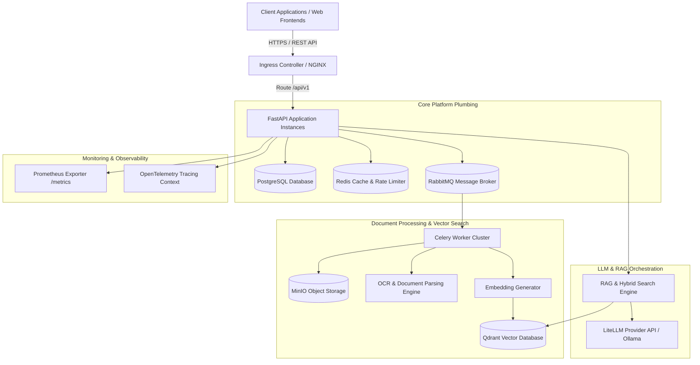
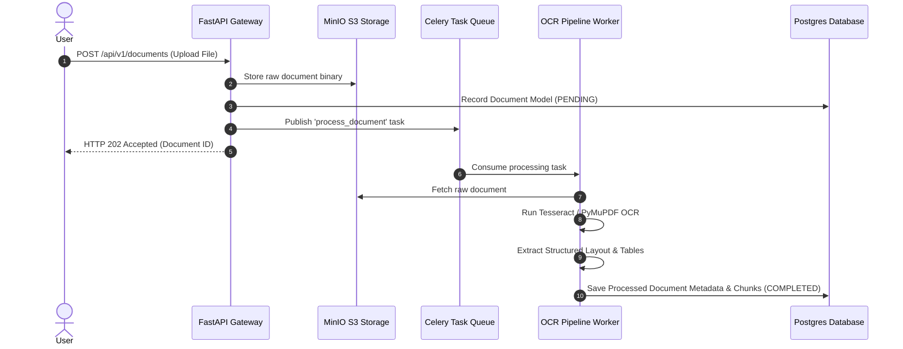
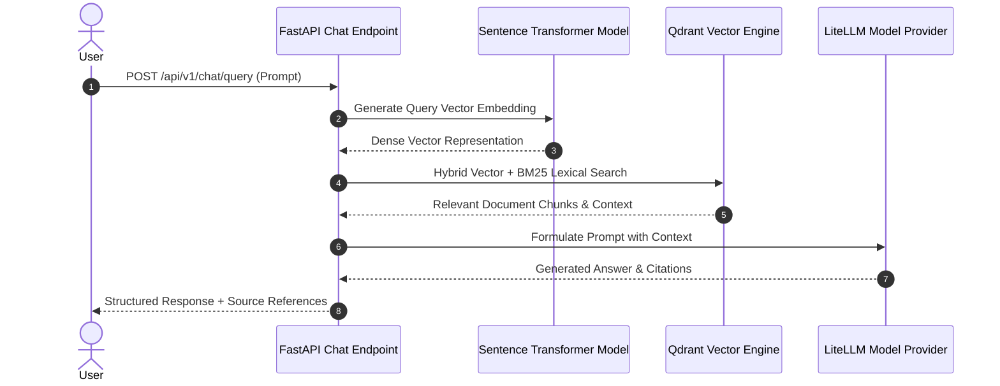
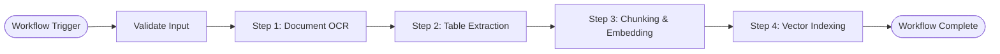
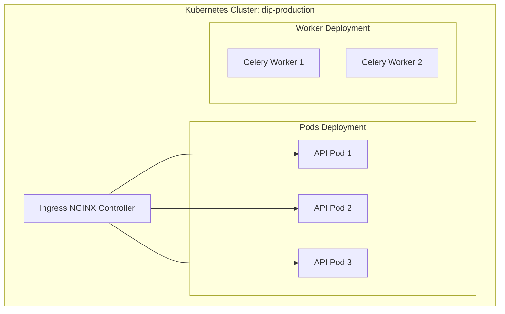

# Enterprise AI Document Intelligence Platform — Architecture & System Design

## 1. Overall System Architecture

---

## 2. OCR & Document Processing Pipeline

---

## 3. RAG Query & Conversational Flow

---

## 4. Workflow Engine Orchestration

---

## 5. Deployment Architecture & K8s Topology

