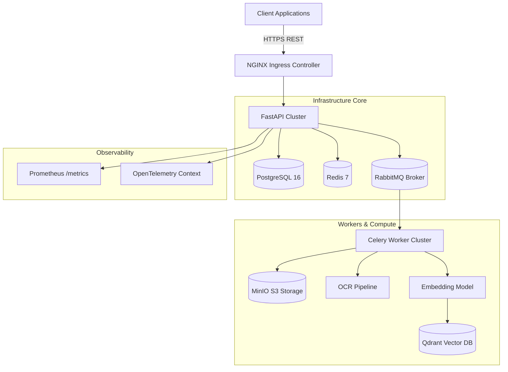
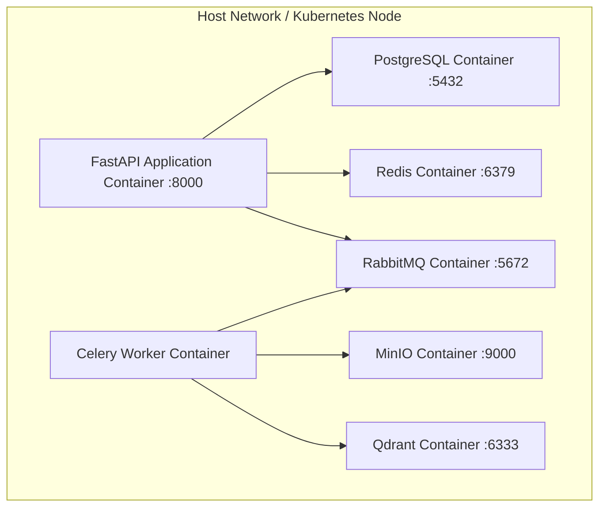
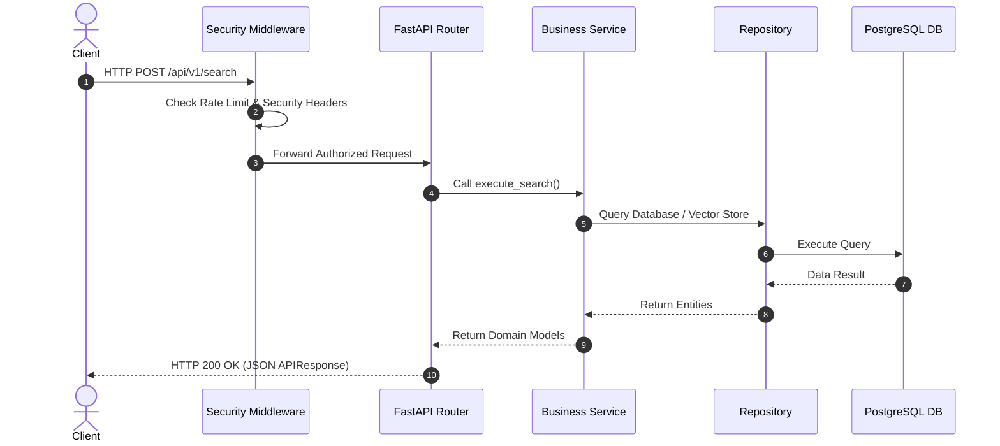
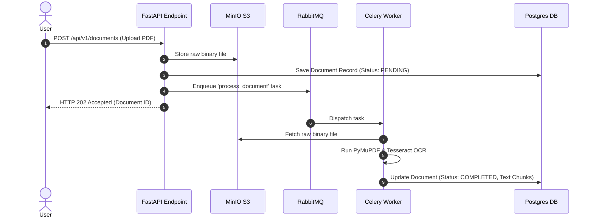
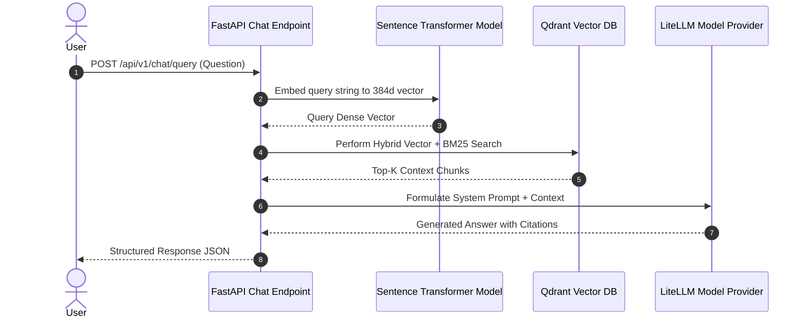
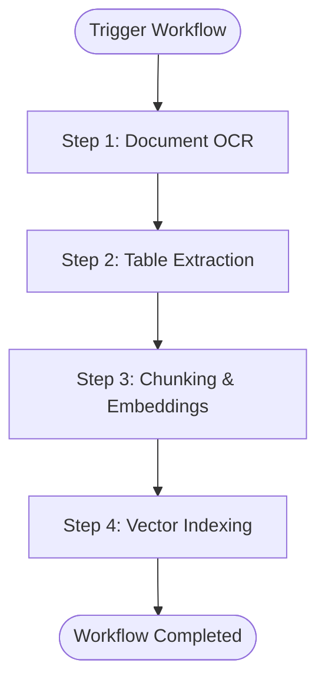
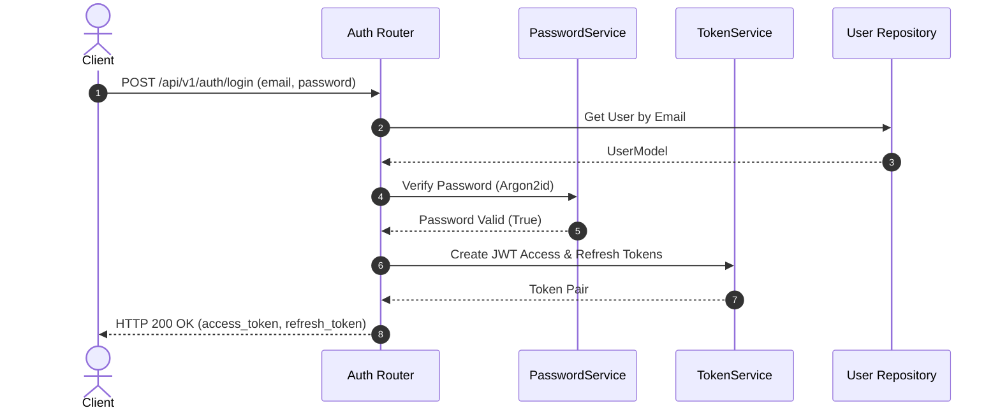

# Enterprise System Diagrams

This document contains 8 Mermaid architecture diagrams illustrating the design of the **Enterprise AI Document Intelligence Platform**.

---

## 1. System Architecture



---

## 2. Container Diagram



---

## 3. Synchronous Request Flow



---

## 4. Asynchronous OCR Processing Flow



---

## 5. Enterprise RAG Pipeline Flow



---

## 6. Workflow DAG Execution Flow



---

## 7. Kubernetes Deployment Architecture

```mermaid
graph TB
    subgraph Namespace: dip-production
        Ingress[NGINX Ingress Controller]
        HPA[HorizontalPodAutoscaler]
        
        subgraph Pods Deployment
            Pod1[API Pod 1]
            Pod2[API Pod 2]
            Pod3[API Pod 3]
        end
        
        Ingress --> Pod1
        Ingress --> Pod2
        Ingress --> Pod3
        HPA -. Scales .-> Pods Deployment
    end
```

---

## 8. Authentication Flow


